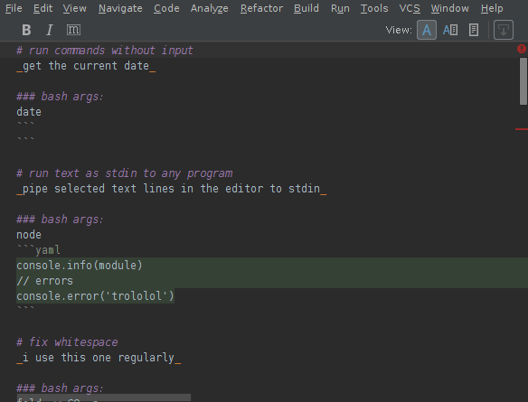

# Pipeprofen
_[pahy-pyoo-proh-fuhn, pahy-peh-proh-fen]_; **noun**

**Run a bash shell command on the selected lines.**

Execute a bash process that pipes the selected lines as if 
they were an input file, same as **stdin**, through a 
custom bash shell command. The output from the process 
replaces the selection with **stderr** and **stdout**. 
Works with multiple carets by piping each selection region 
separately into their own process. Also works with no 
carets.

**General usage instructions**  
Invoke with 
<kbd>ctrl</kbd><kbd>alt</kbd><kbd>shift</kbd><kbd>x</kbd>, 
or by selecting text and right-click the editor to show the 
context menu. The menu item is called **Pipe selected text 
to bash**. When no lines are selected, use the keyboard 
shortcut to open the bash argument window.

**Demo**  

**Features**

*   Remembers the last command arguments
*   Treats output containing either stderr and stdout the same
*   Works with multiple carets, 1 caret and no carets
*   Bug-free on Linux
*   Actively supported - [open an issue on github](https://github.com/profbear/pipeprofen/issues)
*   Unlicensed, free public domain source

**Note:** you must have bash in your environment's PATH.

Being able to run anything in the editor and change the 
buffer text was heavily inspired by emacs's lisp 
expressions 
[(eval-last-sexp), (eval-defun) and (eval-expression)](https://www.gnu.org/software/emacs/manual/html_node/emacs/Lisp-Eval.html#Lisp-Eval).
This plugin is intended to be a drop-in replacement for
the antiquated Shell Process plugin.

## usage
default keymap: <kbd>ctrl</kbd><kbd>alt</kbd><kbd>shift</kbd><kbd>x</kbd>

1. highlight lots of text
    1. **note**: works for multiple carets, too (latest jetbrains)
1. press keyboard shortcut
1. enter the command that bash runs

## internals
    for each selection block s
      create temp file f from s characters
      show prompt to get args
      pipe f as stdin to `bash -c ${args}`
      replace s with (stdout + stderr)
    remove selection

## demo
_the demo below was created from [this screencast.md file](/screencast.md)_

# coc
Praise God, St. Benedict and the
[sqlite coc](/CODE_OF_CONDUCT.md)
`#usethatword` `#nationalism` :us: :us: :us:

# todo
1. option toggles keep/replace selected text
1. default no args text to `xargs -I{} bash -c '{}'`
    1. or create a token to simplify the re-typing of common args
1. environment variables
1. history holding of previous args (and inputs? meh)
1. ingest `args` from clipboard, like so `$(bash -c clipboard)`
1. customize `bash -c` in case bash is not present
1. tokenize editor contents to use tokens as a testing framework
    1. e.g.: read editor contents, parse AST, pipe code to bash args

# thanks
Thank you for using my plugin, no bullshit.
Help me improve it by loggin' a bug.

Cheers!

> Copyright (c) 2018 Unbearable Professional
> 
> This is free and unencumbered software released into the public domain.
> 
> Anyone is free to copy, modify, publish, use, compile, sell, or
> distribute this software, either in source code form or as a compiled
> binary, for any purpose, commercial or non-commercial, and by any
> means.
> 
> In jurisdictions that recognize copyright laws, the author or authors
> of this software dedicate any and all copyright interest in the
> software to the public domain. We make this dedication for the benefit
> of the public at large and to the detriment of our heirs and
> successors. We intend this dedication to be an overt act of
> relinquishment in perpetuity of all present and future rights to this
> software under copyright law.
> 
> THE SOFTWARE IS PROVIDED "AS IS", WITHOUT WARRANTY OF ANY KIND,
> EXPRESS OR IMPLIED, INCLUDING BUT NOT LIMITED TO THE WARRANTIES OF
> MERCHANTABILITY, FITNESS FOR A PARTICULAR PURPOSE AND NONINFRINGEMENT.
> IN NO EVENT SHALL THE AUTHORS BE LIABLE FOR ANY CLAIM, DAMAGES OR
> OTHER LIABILITY, WHETHER IN AN ACTION OF CONTRACT, TORT OR OTHERWISE,
> ARISING FROM, OUT OF OR IN CONNECTION WITH THE SOFTWARE OR THE USE OR
> OTHER DEALINGS IN THE SOFTWARE.
> 
> For more information, please refer to http://unlicense.org/
